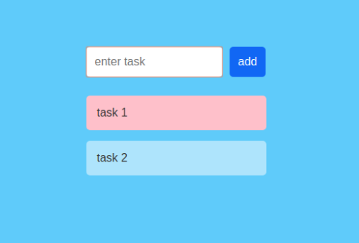

# React TodoList 

this is a very simple todo list application written using React.js

the `node_modules` have not been uploaded.

<h3>How to run it</h3> 

```

  create-react-app todolist

```

replace the public and src folders with those in this repo. 
```
  npm start
```

<h3>Results</h3>
